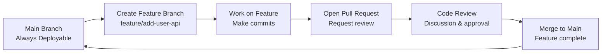

# Module 1: Team Workflows & GitHub Flow
*Duration: 60 minutes*

## Learning Objectives
By the end of this module, you'll be able to:
- Understand GitHub Flow branching strategy and why it works for small teams
- Implement proper branch naming conventions
- Create and manage Pull Requests (PRs) effectively
- Apply code review best practices for small teams

---

## Concepts Section (20 minutes)

### GitHub Flow vs. Other Strategies

**GitHub Flow** is a lightweight, branch-based workflow that's perfect for small teams like yours. Here's why we're using it instead of more complex strategies:



**Why GitHub Flow for your team:**
- **Simple**: Only one long-lived branch (main)
- **Fast**: No complex branching rules to remember
- **Safe**: Main branch is always deployable
- **Collaborative**: Built around Pull Requests and code review

### Branch Naming Conventions

Consistent naming helps your team understand what each branch does at a glance:

**Recommended patterns:**
- `feature/task-description` (e.g., `feature/add-user-authentication`)
- `bugfix/issue-number` (e.g., `bugfix/fix-login-validation`)
- `hotfix/critical-fix` (for urgent production fixes - we'll cover this later)

**Avoid these patterns:**
- Personal names: ~~`johns-work`~~
- Vague descriptions: ~~`updates`~~, ~~`fixes`~~
- Spaces or special characters: ~~`feature/user api`~~

### Pull Request Workflow

The Pull Request (PR) is the heart of GitHub Flow. Here's the proper lifecycle:

1. **Draft PR**: Use when work is in progress, not ready for review
2. **Ready for Review**: Mark when code is complete and tested
3. **Review Process**: Team members examine code, suggest changes
4. **Approved**: Code meets quality standards
5. **Merged**: Changes are integrated into main branch

**Key terminology correction**: It's a "Pull Request" not a "merge request" (that's GitLab terminology).

### Code Review Best Practices

For your 5-person team, here are essential review practices:

**What to look for:**
- Code correctness and logic
- Adherence to team coding standards
- Security considerations
- Performance implications
- Test coverage

**How to provide feedback:**
- Be specific: "Consider using a dictionary here for O(1) lookup" vs. "This is slow"
- Be constructive: Suggest solutions, not just problems
- Ask questions: "Could you explain why you chose this approach?"
- Praise good work: Recognize clever solutions or clean code

---

## Practice Lab (25 minutes)

Let's implement everything we just learned! 

### Step 1: Create Your Repository (5 minutes)

1. Go to GitHub.com and create a new repository
2. Name it: `github-cicd-practice`
3. Make it public
4. Initialize with a README
5. Clone it to your local machine:
   ```bash
   git clone https://github.com/yourusername/github-cicd-practice.git
   cd github-cicd-practice
   ```

### Step 2: Create Basic .NET Web API (8 minutes)
# TODO
> git reset --soft HEAD~1 vs --mixed vs -- hard vs plain old git reset
> dotnet new gitignore

```bash
# Create new Web API project
dotnet new webapi -n WeatherAPI
cd WeatherAPI

# Test it works
dotnet run
```

Visit `https://localhost:5001/weatherforecast` to verify it's working, then stop the server (Ctrl+C).

Add and commit your initial API:
```bash
git add .
git commit -m "Initial Web API setup"
git push origin main
```

### Step 3: Set Up Branch Protection Rules (5 minutes)

In your GitHub repository:
1. Go to **Settings** → **Branches**
2. Click **Add rule** for the main branch
3. Enable:
   - ✅ Require a pull request before merging
   - ✅ Require approvals (set to 1 for practice)
   - ✅ Dismiss stale PR approvals when new commits are pushed

### Step 4: Create Feature Branch and Make Changes (5 minutes)

```bash
# Create and switch to feature branch
git checkout -b feature/add-product-controller

# Create new controller
mkdir Controllers # if it doesn't exist
```

Create `Controllers/ProductController.cs`:
```csharp
using Microsoft.AspNetCore.Mvc;

namespace WeatherAPI.Controllers
{
    [ApiController]
    [Route("api/[controller]")]
    public class ProductController : ControllerBase
    {
        [HttpGet]
        public IActionResult GetProducts()
        {
            var products = new[]
            {
                new { Id = 1, Name = "Laptop", Price = 999.99 },
                new { Id = 2, Name = "Mouse", Price = 29.99 }
            };
            return Ok(products);
        }
    }
}
```

Commit your changes:
```bash
git add .
git commit -m "Add ProductController with GetProducts endpoint"
git push origin feature/add-product-controller
```

### Step 5: Create Pull Request (2 minutes)

1. Go to your GitHub repository
2. You should see a prompt to create a PR for your new branch
3. Click **"Compare & pull request"**
4. Write a good PR description:
   ```
   ## Changes
   - Added ProductController with GetProducts endpoint
   - Returns sample product data (Laptop, Mouse)
   
   ## Testing
   - Manually tested endpoint returns expected JSON
   - Endpoint accessible at `/api/product`
   
   ## Notes
   - Using anonymous objects for now, will create proper models later
   ```

**Terminology note**: This creates a Pull Request, not a "code review request" - the review is part of the PR process.

---

## Team Scenario (10 minutes)

Let's discuss this realistic scenario:

**Scenario**: Two developers are working on the same repository. Developer A creates `feature/add-user-api` and Developer B creates `feature/add-user-validation`. Both need to modify the same User model.

**Discussion Points:**

1. **Communication Strategy**: How should they coordinate?
   - Check existing branches before starting work
   - Communicate in team chat about overlapping areas
   - Consider who should go first based on complexity

2. **Handling Conflicts**: What happens when both PRs are ready?
   - First merged PR goes smoothly
   - Second PR will have merge conflicts
   - Developer B needs to update their branch with main

3. **Resolution Process**:
   ```bash
   # Developer B updates their branch
   git checkout feature/add-user-validation
   git fetch origin
   git merge origin/main
   # Resolve any conflicts in IDE
   git add .
   git commit -m "Resolve merge conflicts with main"
   git push origin feature/add-user-validation
   ```

**Best Practice**: Small, focused PRs reduce conflict likelihood. Instead of one large "user feature" PR, consider breaking it into smaller pieces.

---

## Validation Questions (5 minutes)

Let's check your understanding:

**1. What makes a good Pull Request description?**
- Clear explanation of what changed
- Why the change was needed  
- How to test the changes
- Any special considerations or notes

**2. When should you create a draft PR vs. a ready-for-review PR?**
- **Draft PR**: Work in progress, not ready for review, want early feedback on approach
- **Ready-for-review PR**: Code is complete, tested, and ready for team review

**3. What's the difference between merge, squash and merge, and rebase and merge?**
- **Merge**: Preserves all commits and creates a merge commit
- **Squash and merge**: Combines all commits into one clean commit
- **Rebase and merge**: Replays commits without creating a merge commit

For your small team, I recommend "Squash and merge" to keep main branch history clean.

---

## Module 1 Complete!

You now understand:
✅ GitHub Flow and why it works for small teams  
✅ Proper branch naming conventions  
✅ Pull Request lifecycle and best practices  
✅ Code review fundamentals  
✅ How to handle basic team coordination  

**Next up**: Module 2 will introduce GitHub Actions fundamentals, where we'll automate the build process for your Web API.

Any questions about GitHub Flow, Pull Requests, or the concepts we covered in Module 1?