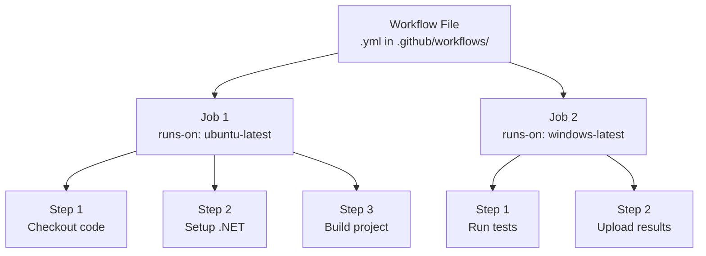

# Module 2: GitHub Actions Fundamentals
*Duration: 60 minutes*

## Learning Objectives
By the end of this module, you'll be able to:
- Understand GitHub Actions terminology (workflows, jobs, steps, actions)
- Create basic workflow files using YAML
- Configure workflow triggers and runners
- Debug workflow failures

---

## Concepts Section (20 minutes)

### Core Terminology

Understanding the terminology is crucial for effective GitHub Actions usage. Let's clarify each term:

**Workflow**: A configurable automated process made up of one or more jobs, defined in a YAML file stored in `.github/workflows/`

**Job**: A set of steps that execute on the same runner. Jobs run in parallel by default unless you specify dependencies.

**Step**: An individual task within a job. Can run shell commands or use pre-built actions.

**Action**: A custom application that performs a frequently repeated task. Can be your own or from the GitHub Marketplace.

**Runner**: A server (virtual machine) that runs your workflows when triggered. Can be GitHub-hosted or self-hosted.



**Common terminology corrections**:
- It's a "workflow", not a "pipeline" (though pipeline is acceptable, workflow is the GitHub term)
- It's a "runner", not a "build agent" 
- It's an "action", not a "task" or "plugin"

### Workflow Triggers

Triggers determine when your workflow runs. Here are the most common ones:

**push**: Runs when code is pushed to specified branches
```yaml
on:
  push:
    branches: [ main, develop ]
```

**pull_request**: Runs when PRs are opened, updated, or reopened
```yaml
on:
  pull_request:
    branches: [ main ]
```

**workflow_dispatch**: Allows manual triggering from GitHub UI
```yaml
on:
  workflow_dispatch:
```

**schedule**: Runs on a schedule using cron syntax
```yaml
on:
  schedule:
    - cron: '0 2 * * *'  # Daily at 2 AM
```

**Combined triggers**:
```yaml
on:
  push:
    branches: [ main ]
  pull_request:
    branches: [ main ]
  workflow_dispatch:
```

### Runner Types

**GitHub-hosted runners**: Free (with limits), managed by GitHub, clean environment each run
- `ubuntu-latest` (most common for .NET)
- `windows-latest` 
- `macos-latest`

**Self-hosted runners**: Your own infrastructure, more control, potentially faster, but you manage them

For your small team, GitHub-hosted runners are perfect to start with.

### Workflow File Structure

Workflows must be stored in `.github/workflows/` directory and have `.yml` or `.yaml` extension.

Basic structure:
```yaml
name: CI Build                    # Workflow name (optional)
on: [push, pull_request]         # Triggers
jobs:                            # Jobs section
  build:                         # Job ID
    runs-on: ubuntu-latest       # Runner type
    steps:                       # Steps section
    - name: Checkout code        # Step name (optional)
      uses: actions/checkout@v4  # Pre-built action
    - name: Setup .NET           # Another step
      uses: actions/setup-dotnet@v3
      with:                      # Action parameters
        dotnet-version: '8.0.x'
```

---

## Practice Lab (30 minutes)

Let's create your first GitHub Action workflow!

### Step 1: Create Workflow Directory and File (5 minutes)

In your `github-cicd-practice` repository from Module 1:

```bash
# Navigate to your repo root
cd github-cicd-practice

# Create workflows directory
mkdir -p .github/workflows

# Create workflow file
touch .github/workflows/basic-ci.yml
```

### Step 2: Write Your First Workflow (15 minutes)

Edit `.github/workflows/basic-ci.yml` and add this content:

```yaml
name: Basic CI

# Trigger on push to main and on pull requests
on:
  push:
    branches: [ main ]
  pull_request:
    branches: [ main ]

# Define jobs
jobs:
  build:
    runs-on: ubuntu-latest
    
    steps:
    # Step 1: Get the code
    - name: Checkout repository
      uses: actions/checkout@v4
    
    # Step 2: Setup .NET environment  
    - name: Setup .NET
      uses: actions/setup-dotnet@v3
      with:
        dotnet-version: '8.0.x'
    
    # Step 3: Restore NuGet packages
    - name: Restore dependencies
      run: dotnet restore WeatherAPI/WeatherAPI.csproj
      
    # Step 4: Build the application
    - name: Build application
      run: dotnet build WeatherAPI/WeatherAPI.csproj --no-restore --configuration Release
    
    # Step 5: Display build information
    - name: Display build info
      run: |
        echo "Build completed successfully!"
        echo "Build time: $(date)"
        dotnet --version
```

**Key points about this workflow**:
- **Triggers**: Runs on pushes to main and on pull requests
- **Runner**: Uses Ubuntu (Linux) - most cost-effective for .NET
- **Actions used**: `checkout@v4` and `setup-dotnet@v3` from GitHub Marketplace
- **Commands**: Standard dotnet CLI commands you already know
- **Multi-line commands**: Use the `|` operator for multiple commands

### Step 3: Commit and Test the Workflow (8 minutes)

```bash
# Add the workflow file
git add .github/workflows/basic-ci.yml
git commit -m "Add basic CI workflow"

# Push to main - this will trigger the workflow!
git push origin main
```

Now go to your GitHub repository and:
1. Click the **Actions** tab
2. You should see your "Basic CI" workflow running
3. Click on the workflow run to see details
4. Click on the "build" job to see individual step logs

### Step 4: Test with a Pull Request (2 minutes)

Let's see the workflow run on a PR:

```bash
# Create new feature branch
git checkout -b feature/test-workflow

# Make a small change to trigger the workflow
echo "# Test Change" >> README.md
git add README.md
git commit -m "Test workflow on PR"
git push origin feature/test-workflow
```

Go to GitHub and create a PR from this branch. You should see the workflow running on the PR!

**Important terminology note**: The workflow "runs" when triggered, individual jobs "execute", and steps "run commands" or "use actions".

---

## Team Scenario (5 minutes)

**Scenario**: A developer pushes code that breaks the build. The GitHub Action fails with this error:

```
Error: WeatherAPI/Controllers/ProductController.cs(15,13): 
error CS1002: ; expected [WeatherAPI/WeatherAPI.csproj]
```

**Discussion Points:**

1. **How to interpret workflow failure logs**:
   - Red X indicates failure
   - Click into the job to see which step failed
   - Expand the failing step to see detailed error messages
   - Look for compiler errors, missing files, or configuration issues

2. **Steps to fix and re-run the workflow**:
   - Fix the code issue locally
   - Commit and push the fix
   - Workflow automatically runs again on the new push
   - No need to manually re-run unless you want to

3. **Communication protocols when builds fail**:
   - Developer should fix their own failing builds quickly
   - If stuck, ask team for help within 15-30 minutes
   - Don't merge PRs with failing builds
   - Team lead should be notified of repeated failures

**Best Practice**: Test your build locally with `dotnet build` before pushing to catch obvious issues.

---

## Validation Questions (5 minutes)

Let's verify your understanding:

**1. What's the difference between a workflow and a job?**

*Answer*: A **workflow** is the entire automated process defined in a YAML file. A **job** is a subset of steps within that workflow that runs on a single runner. One workflow can have multiple jobs that run in parallel.

**2. Where do GitHub Action workflow files need to be stored?**

*Answer*: In the `.github/workflows/` directory at the root of your repository. Files must have `.yml` or `.yaml` extension.

**3. What happens when a workflow fails on a Pull Request?**

*Answer*: 
- The PR shows a red X indicating checks failed
- The failing workflow blocks merge if branch protection rules require passing checks
- Developers can see detailed error logs in the Actions tab
- The workflow will re-run automatically when new commits are pushed to the PR branch

**Additional Question**: What's the difference between `uses` and `run` in a workflow step?

*Answer*: 
- `uses`: References a pre-built action from GitHub Marketplace or your repository
- `run`: Executes shell commands directly on the runner

---

## Troubleshooting Common Issues

### Workflow not triggering?
- Check file location: Must be in `.github/workflows/`
- Check YAML syntax: Use a YAML validator
- Check trigger configuration: Ensure `on:` section matches your use case

### Build failing?
- Check file paths in `run` commands
- Ensure .NET version matches your project
- Verify all required files are committed and pushed

### Can't find logs?
- Go to **Actions** tab in your repository
- Click on the specific workflow run
- Click on the job name to see step-by-step logs

---

## Module 2 Complete!

You now understand:
✅ GitHub Actions terminology (workflow, job, step, action, runner)  
✅ How to create workflow files using YAML  
✅ Common triggers and when to use them  
✅ How to debug workflow failures  
✅ The difference between actions and shell commands  

**Next up**: Module 3 will add unit testing and code coverage to your CI pipeline, making your builds even more robust.

Your repository now has automated builds running on every push and pull request - a huge step toward reliable software delivery!