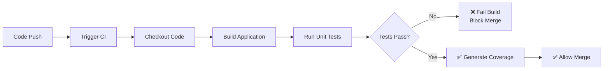

# Module 3: CI Pipeline with Testing
*Duration: 60 minutes*

## Learning Objectives
By the end of this module, you'll be able to:
- Integrate unit testing into CI pipelines
- Understand code coverage concepts and enforcement
- Configure test result reporting
- Handle test failures in automated workflows

---

## Concepts Section (15 minutes)

### Continuous Integration (CI) with Testing

**Continuous Integration (CI)** is the practice of automatically building and testing code changes as they're integrated into the main branch. Testing is a critical component of CI because it:

- Catches bugs before they reach production
- Provides confidence that changes don't break existing functionality
- Enables faster development by providing immediate feedback
- Supports safe refactoring and code improvements



### Unit Testing in CI

**Unit tests** verify individual components of your application work correctly in isolation. In a CI pipeline, unit tests should be:

- **Fast**: Run quickly to provide rapid feedback
- **Reliable**: Consistent results, not flaky
- **Independent**: Don't depend on external resources
- **Focused**: Test one thing at a time

**Key terminology correction**: These are "unit tests", not "test units" or "testing units".

### Code Coverage Concepts

**Code Coverage** measures how much of your code is executed during testing. Common metrics include:

- **Line Coverage**: Percentage of code lines executed by tests
- **Branch Coverage**: Percentage of code branches (if/else paths) tested
- **Method Coverage**: Percentage of methods called by tests

**Code Coverage Enforcement** means setting minimum thresholds that must be met for the build to pass:

```
Example: Require 80% line coverage
- If tests cover 85% of lines → Build passes ✅
- If tests cover 75% of lines → Build fails ❌
```

**Important**: High coverage doesn't guarantee good tests, but low coverage often indicates insufficient testing.

### Test Result Reporting

Modern CI systems display test results directly in Pull Requests, showing:
- Number of tests run
- Pass/fail status
- Failed test details
- Coverage reports
- Trends over time

This makes it easy for reviewers to understand the impact of changes.

---

## Practice Lab (35 minutes)

Let's add comprehensive testing to your CI pipeline!

### Step 1: Add xUnit Test Project (10 minutes)

Navigate to your repository and create a test project:

```bash
cd github-cicd-practice

# Create test project
dotnet new xunit -n WeatherAPI.Tests

# Add reference to main project
cd WeatherAPI.Tests
dotnet add reference ../WeatherAPI/WeatherAPI.csproj

# Add required testing packages
dotnet add package Microsoft.AspNetCore.Mvc.Testing
dotnet add package coverlet.collector
dotnet add package coverlet.msbuild
```

Create a solution file to organize projects:
```bash
cd ..
dotnet new sln -n WeatherAPI
dotnet sln add WeatherAPI/WeatherAPI.csproj
dotnet sln add WeatherAPI.Tests/WeatherAPI.Tests.csproj
```

### Step 2: Write Unit Tests (10 minutes)

Create `WeatherAPI.Tests/Controllers/ProductControllerTests.cs`:

```csharp
using Microsoft.AspNetCore.Mvc;
using WeatherAPI.Controllers;
using Xunit;

namespace WeatherAPI.Tests.Controllers
{
    public class ProductControllerTests
    {
        private readonly ProductController _controller;

        public ProductControllerTests()
        {
            _controller = new ProductController();
        }

        [Fact]
        public void GetProducts_ReturnsOkResult()
        {
            // Act
            var result = _controller.GetProducts();

            // Assert
            Assert.IsType<OkObjectResult>(result);
        }

        [Fact]
        public void GetProducts_ReturnsTwoProducts()
        {
            // Act
            var result = _controller.GetProducts() as OkObjectResult;
            var products = result?.Value as dynamic[];

            // Assert
            Assert.NotNull(products);
            Assert.Equal(2, products.Length);
        }

        [Fact]
        public void GetProducts_ReturnsExpectedProductNames()
        {
            // Act
            var result = _controller.GetProducts() as OkObjectResult;
            var products = result?.Value as dynamic[];

            // Assert
            Assert.NotNull(products);
            Assert.Equal("Laptop", products[0].Name.ToString());
            Assert.Equal("Mouse", products[1].Name.ToString());
        }
    }
}
```

Create `WeatherAPI.Tests/Controllers/WeatherForecastControllerTests.cs`:

```csharp
using Microsoft.Extensions.Logging;
using WeatherAPI.Controllers;
using Xunit;
using Microsoft.AspNetCore.Mvc;
using Moq;

namespace WeatherAPI.Tests.Controllers
{
    public class WeatherForecastControllerTests
    {
        [Fact]
        public void Get_ReturnsWeatherForecast()
        {
            // Arrange
            var mockLogger = new Mock<ILogger<WeatherForecastController>>();
            var controller = new WeatherForecastController(mockLogger.Object);

            // Act
            var result = controller.Get();

            // Assert
            Assert.NotNull(result);
            Assert.Equal(5, result.Count());
        }
    }
}
```

Test locally to ensure everything works:
```bash
dotnet test
```

### Step 3: Update CI Workflow with Testing (10 minutes)

Edit `.github/workflows/basic-ci.yml` and replace with:

```yaml
name: CI with Testing

on:
  push:
    branches: [ main ]
  pull_request:
    branches: [ main ]

jobs:
  test:
    runs-on: ubuntu-latest
    
    steps:
    - name: Checkout repository
      uses: actions/checkout@v4
    
    - name: Setup .NET
      uses: actions/setup-dotnet@v3
      with:
        dotnet-version: '8.0.x'
    
    - name: Restore dependencies
      run: dotnet restore WeatherAPI.sln
      
    - name: Build application
      run: dotnet build WeatherAPI.sln --no-restore --configuration Release
    
    - name: Run unit tests
      run: dotnet test WeatherAPI.Tests/WeatherAPI.Tests.csproj --no-build --configuration Release --verbosity normal
    
    - name: Run tests with coverage
      run: dotnet test WeatherAPI.Tests/WeatherAPI.Tests.csproj --no-build --configuration Release --collect:"XPlat Code Coverage" --results-directory ./coverage
    
    - name: Generate coverage report
      run: |
        dotnet tool install -g dotnet-reportgenerator-globaltool
        reportgenerator -reports:"coverage/**/coverage.cobertura.xml" -targetdir:"coverage/report" -reporttypes:Html
    
    - name: Upload coverage reports
      uses: actions/upload-artifact@v4
      with:
        name: coverage-report
        path: coverage/report/
    
    - name: Coverage Summary
      run: |
        echo "## Test Coverage Summary" >> $GITHUB_STEP_SUMMARY
        echo "Coverage reports have been generated and uploaded as artifacts." >> $GITHUB_STEP_SUMMARY
        echo "Download the 'coverage-report' artifact to view detailed coverage information." >> $GITHUB_STEP_SUMMARY
```

**Key additions explained**:
- **Separate test step**: Makes it clear when tests fail vs. build failures
- **Coverage collection**: Uses `--collect:"XPlat Code Coverage"` to gather coverage data
- **Report generation**: Creates human-readable HTML coverage reports
- **Artifact upload**: Makes coverage reports downloadable from GitHub Actions
- **Job renamed**: From "build" to "test" to reflect its expanded purpose

### Step 4: Add Coverage Enforcement (3 minutes)

Add a step to fail the build if coverage is too low. Add this step after the coverage report generation:

```yaml
    - name: Enforce coverage threshold
      run: |
        # Extract coverage percentage (this is a simplified example)
        echo "Checking coverage threshold..."
        # In a real project, you'd parse the coverage report here
        # For now, we'll just demonstrate the concept
        COVERAGE=85
        THRESHOLD=75
        
        if [ $COVERAGE -lt $THRESHOLD ]; then
          echo "❌ Coverage ($COVERAGE%) is below threshold ($THRESHOLD%)"
          echo "Please add more tests to improve coverage."
          exit 1
        else
          echo "✅ Coverage ($COVERAGE%) meets threshold ($THRESHOLD%)"
        fi
```

### Step 5: Test the Enhanced Pipeline (2 minutes)

```bash
# Commit all changes
git add .
git commit -m "Add unit tests and coverage to CI pipeline"
git push origin main
```

Watch your workflow run in the GitHub Actions tab. You should see:
- Build succeeding
- Tests running and passing
- Coverage reports being generated
- Artifacts being uploaded

---

## Team Scenario (5 minutes)

**Scenario**: Two developers submit PRs simultaneously. Developer A's tests pass with good coverage, but Developer B's tests fail due to a logical error in their new feature.

**Discussion Points:**

1. **How CI prevents bad code from reaching main**:
   - Developer A's PR shows green checkmarks → Safe to merge
   - Developer B's PR shows red X → Blocked from merging
   - Main branch stays stable because failing code can't be merged

2. **Coordination strategies for dependent features**:
   - Check if your feature depends on someone else's work
   - Coordinate merge order: dependencies first, then dependent features
   - Use draft PRs to signal work in progress

3. **When to merge vs. wait for fixes**:
   - **Never merge failing tests** - this breaks the CI principle
   - Developer B should fix tests quickly or ask for help
   - If fix is complex, consider reverting problematic changes temporarily

**Best Practices for your team**:
- Run tests locally before pushing: `dotnet test`
- Keep tests fast - aim for under 1 minute total test time
- Write tests for new features as you develop them
- If you break someone else's tests, help them fix it

---

## Validation Questions (5 minutes)

Let's verify your understanding:

**1. What is code coverage and why is it important?**

*Answer*: Code coverage measures how much of your code is executed during testing, typically expressed as a percentage. It's important because:
- Identifies untested code that might contain bugs
- Helps ensure comprehensive testing
- Provides confidence when refactoring
- However, high coverage doesn't guarantee good tests - quality matters more than quantity

**2. What should happen when tests fail in a CI pipeline?**

*Answer*: When tests fail in CI:
- The build should fail (return non-zero exit code)
- The failing build should block Pull Request merges
- Developers should receive immediate feedback about which tests failed
- The team should fix failing tests quickly to unblock development
- Never ignore or skip failing tests - they indicate real problems

**3. How does automated testing support the code review process?**

*Answer*: Automated testing supports code review by:
- Providing objective verification that code works
- Freeing reviewers to focus on design and logic instead of basic functionality
- Catching regressions that reviewers might miss
- Building confidence in code changes
- Documenting expected behavior through test cases

**Additional Question**: What's the difference between running tests locally vs. in CI?

*Answer*: 
- **Local tests**: Fast feedback during development, might use developer-specific environment
- **CI tests**: Consistent environment, enforces quality gates, prevents bad code from merging
- Both are important - local for development speed, CI for team protection

---

## Troubleshooting Common Testing Issues

### Tests pass locally but fail in CI?
- Environment differences (file paths, database connections, time zones)
- Missing test dependencies or configuration files
- Parallel test execution causing conflicts

### Coverage reports not generating?
- Ensure `coverlet.collector` package is installed
- Check that `--collect:"XPlat Code Coverage"` is specified correctly
- Verify coverage files are being created in the expected location

### Tests taking too long?
- Review test independence - avoid database calls in unit tests
- Use mocking for external dependencies
- Consider parallel test execution
- Split large test suites into focused test projects

---

## Module 3 Complete!

You now understand:
✅ How to integrate unit testing into CI pipelines  
✅ Code coverage concepts and enforcement  
✅ Test result reporting and artifact management  
✅ How testing supports team collaboration and code quality  
✅ Troubleshooting common testing issues in CI  

**Next up**: Module 4 will extend your pipeline to deploy to multiple environments (dev, staging, production), completing your CI/CD pipeline.

Your repository now has a robust CI pipeline that catches bugs early and maintains code quality automatically!