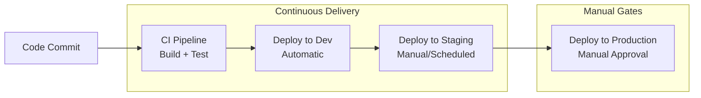
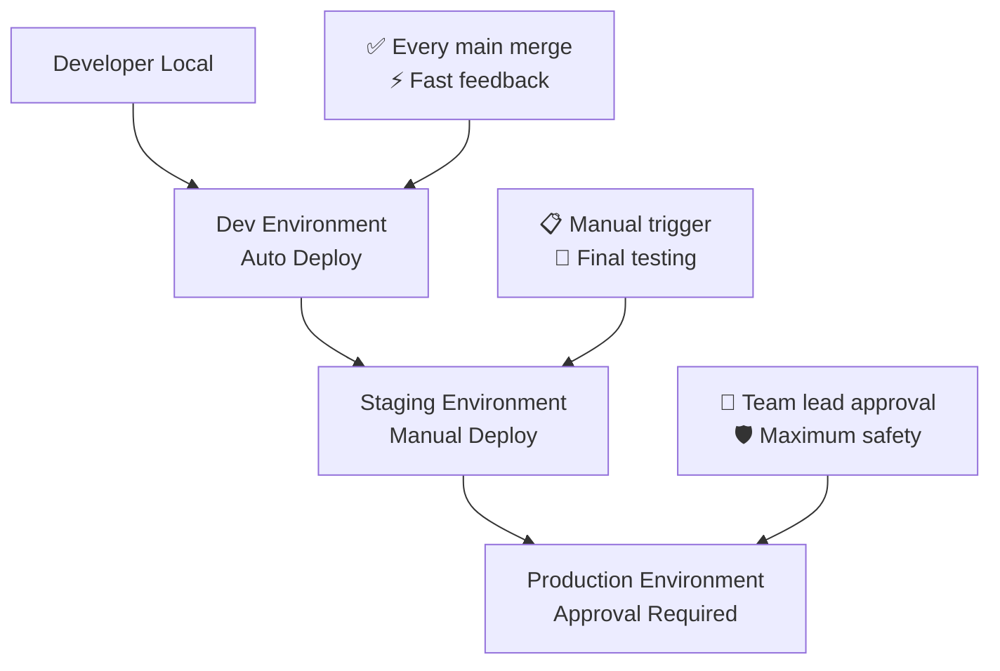

# Module 4: Multi-Environment CD Pipelines
*Duration: 60 minutes*

## Learning Objectives
By the end of this module, you'll be able to:
- Understand Continuous Deployment (CD) concepts
- Design deployment workflows for dev, staging, and production environments
- Implement environment-specific configurations
- Configure deployment approvals and gates

---

## Concepts Section (20 minutes)

### Continuous Deployment vs. Continuous Delivery

It's important to understand the distinction between these terms:

**Continuous Delivery (CD)**: Code changes are automatically built, tested, and prepared for release. However, deployment to production requires manual approval.

**Continuous Deployment**: Code changes are automatically deployed all the way to production without human intervention (after passing all tests).



For your small team, **Continuous Delivery** is the recommended approach - automatic deployment to dev, but manual control over staging and production.

### Environment Promotion Strategy

**Environment Hierarchy** represents the path code takes from development to users:

1. **Dev Environment**: 
   - Automatic deployment on main branch merge
   - Used for integration testing and early validation
   - Can be unstable - it's a testing ground

2. **Staging Environment**:
   - Production-like environment for final testing
   - Manual or scheduled deployments
   - User acceptance testing happens here

3. **Production Environment**:
   - Live user environment
   - Manual approval required
   - Highest stability requirements
   - Rollback procedures essential



### Environment-Specific Configuration

Each environment needs different settings:

- **Database connections**: Dev uses local DB, production uses cloud DB
- **API endpoints**: Different URLs for external services
- **Feature flags**: Enable experimental features in dev, disable in production
- **Logging levels**: Verbose in dev, errors-only in production
- **Resource limits**: Small containers in dev, scaled containers in production

**Key terminology correction**: These are "environment configurations" not "deployment configurations" - the deployment process is similar, but the environment settings differ.

### Deployment Gates and Approvals

**Deployment Gates** are checkpoints that must pass before deployment proceeds:

- **Manual Approval Gates**: Human approval required (for production)
- **Automated Gates**: Health checks, smoke tests, security scans
- **Time-based Gates**: Deploy only during business hours
- **Dependency Gates**: Wait for other systems to be ready

**GitHub Environments** provide built-in support for:
- Required reviewers for deployments
- Wait timers before deployment
- Environment-specific secrets and variables
- Deployment history and rollback capabilities

### Deployment Strategies Overview

While we'll keep this module simple, here are common strategies to know about:

- **Blue-Green**: Two identical environments, switch traffic between them
- **Rolling Updates**: Gradually replace old versions with new versions
- **Canary Deployments**: Deploy to small subset of users first

For this foundation course, we'll use **direct deployment** (replace the current version) with manual gates.

---

## Practice Lab (30 minutes)

Let's build a complete CI/CD pipeline with multiple environments!

### Step 1: Create Environment-Specific Workflow Files (10 minutes)

Create separate workflow files for better organization:

**Create `.github/workflows/ci.yml`** (rename existing workflow):
```yaml
name: Continuous Integration

on:
  push:
    branches: [ main ]
  pull_request:
    branches: [ main ]

jobs:
  test:
    runs-on: ubuntu-latest
    
    steps:
    - name: Checkout repository
      uses: actions/checkout@v4
    
    - name: Setup .NET
      uses: actions/setup-dotnet@v3
      with:
        dotnet-version: '8.0.x'
    
    - name: Restore dependencies
      run: dotnet restore WeatherAPI.sln
      
    - name: Build application
      run: dotnet build WeatherAPI.sln --no-restore --configuration Release
    
    - name: Run unit tests
      run: dotnet test WeatherAPI.Tests/WeatherAPI.Tests.csproj --no-build --configuration Release --verbosity normal
    
    - name: Run tests with coverage
      run: dotnet test WeatherAPI.Tests/WeatherAPI.Tests.csproj --no-build --configuration Release --collect:"XPlat Code Coverage" --results-directory ./coverage
    
    - name: Generate coverage report
      run: |
        dotnet tool install -g dotnet-reportgenerator-globaltool
        reportgenerator -reports:"coverage/**/coverage.cobertura.xml" -targetdir:"coverage/report" -reporttypes:Html
    
    - name: Upload coverage reports
      uses: actions/upload-artifact@v4
      with:
        name: coverage-report
        path: coverage/report/
    
    - name: Upload build artifacts
      uses: actions/upload-artifact@v4
      with:
        name: build-artifacts
        path: WeatherAPI/bin/Release/
```

**Create `.github/workflows/deploy-dev.yml`**:
```yaml
name: Deploy to Dev

on:
  workflow_run:
    workflows: ["Continuous Integration"]
    types: [completed]
    branches: [main]

jobs:
  deploy-dev:
    runs-on: ubuntu-latest
    if: ${{ github.event.workflow_run.conclusion == 'success' }}
    environment: development
    
    steps:
    - name: Checkout repository
      uses: actions/checkout@v4
    
    - name: Download build artifacts
      uses: actions/download-artifact@v4
      with:
        name: build-artifacts
        github-token: ${{ secrets.GITHUB_TOKEN }}
        run-id: ${{ github.event.workflow_run.id }}
    
    - name: Deploy to Dev Environment
      run: |
        echo "🚀 Deploying to Development Environment"
        echo "Environment: Development"
        echo "Build ID: ${{ github.event.workflow_run.id }}"
        echo "Commit: ${{ github.sha }}"
        
        # In a real scenario, this would be:
        # - Deploy to cloud service (Azure, AWS, etc.)
        # - Update configuration for dev environment
        # - Run smoke tests
        echo "✅ Deployment to Dev completed successfully"
    
    - name: Run smoke tests
      run: |
        echo "🧪 Running smoke tests against dev environment"
        # In practice: curl health endpoints, basic API tests
        echo "✅ Smoke tests passed"
    
    - name: Notify team
      run: |
        echo "📢 Dev deployment completed"
        echo "Available at: https://weather-api-dev.example.com"
```

**Create `.github/workflows/deploy-staging.yml`**:
```yaml
name: Deploy to Staging

on:
  workflow_dispatch:
    inputs:
      version:
        description: 'Build version to deploy'
        required: true
        type: string

jobs:
  deploy-staging:
    runs-on: ubuntu-latest
    environment: staging
    
    steps:
    - name: Checkout repository
      uses: actions/checkout@v4
    
    - name: Setup .NET
      uses: actions/setup-dotnet@v3
      with:
        dotnet-version: '8.0.x'
    
    - name: Build for staging
      run: |
        echo "🏗️ Building application for staging deployment"
        dotnet restore WeatherAPI.sln
        dotnet build WeatherAPI.sln --configuration Release
        dotnet publish WeatherAPI/WeatherAPI.csproj -c Release -o ./publish
    
    - name: Deploy to Staging Environment
      run: |
        echo "🚀 Deploying to Staging Environment"
        echo "Environment: Staging"
        echo "Version: ${{ github.event.inputs.version }}"
        echo "Deploying from commit: ${{ github.sha }}"
        
        # In a real scenario:
        # - Deploy to staging cloud resources
        # - Update staging-specific configuration
        # - Database migrations if needed
        echo "✅ Deployment to Staging completed successfully"
    
    - name: Run integration tests
      run: |
        echo "🧪 Running integration tests against staging"
        # In practice: comprehensive API tests, UI tests, performance tests
        sleep 5  # Simulate test execution
        echo "✅ Integration tests passed"
    
    - name: Deployment summary
      run: |
        echo "## Staging Deployment Complete 🎉" >> $GITHUB_STEP_SUMMARY
        echo "- **Version**: ${{ github.event.inputs.version }}" >> $GITHUB_STEP_SUMMARY
        echo "- **Environment**: Staging" >> $GITHUB_STEP_SUMMARY
        echo "- **Status**: ✅ Successful" >> $GITHUB_STEP_SUMMARY
        echo "- **URL**: https://weather-api-staging.example.com" >> $GITHUB_STEP_SUMMARY
```

**Create `.github/workflows/deploy-production.yml`**:
```yaml
name: Deploy to Production

on:
  workflow_dispatch:
    inputs:
      version:
        description: 'Build version to deploy'
        required: true
        type: string
      confirm_deployment:
        description: 'Type "DEPLOY" to confirm'
        required: true
        type: string

jobs:
  validate-input:
    runs-on: ubuntu-latest
    steps:
    - name: Validate deployment confirmation
      run: |
        if [ "${{ github.event.inputs.confirm_deployment }}" != "DEPLOY" ]; then
          echo "❌ Deployment confirmation failed. Please type 'DEPLOY' exactly."
          exit 1
        fi
        echo "✅ Deployment confirmation validated"

  deploy-production:
    needs: validate-input
    runs-on: ubuntu-latest
    environment: production
    
    steps:
    - name: Checkout repository
      uses: actions/checkout@v4
    
    - name: Setup .NET
      uses: actions/setup-dotnet@v3
      with:
        dotnet-version: '8.0.x'
    
    - name: Build for production
      run: |
        echo "🏗️ Building application for production deployment"
        dotnet restore WeatherAPI.sln
        dotnet build WeatherAPI.sln --configuration Release
        dotnet publish WeatherAPI/WeatherAPI.csproj -c Release -o ./publish
    
    - name: Pre-deployment backup
      run: |
        echo "💾 Creating backup of current production deployment"
        # In practice: backup current deployment, database snapshot
        echo "✅ Backup completed"
    
    - name: Deploy to Production Environment
      run: |
        echo "🚀 Deploying to Production Environment"
        echo "Environment: Production"
        echo "Version: ${{ github.event.inputs.version }}"
        echo "Deploying from commit: ${{ github.sha }}"
        echo "Deployed by: ${{ github.actor }}"
        
        # In a real scenario:
        # - Blue-green deployment switch
        # - Update production configuration
        # - Database migrations (if any)
        # - Update load balancer routing
        echo "✅ Deployment to Production completed successfully"
    
    - name: Post-deployment verification
      run: |
        echo "🔍 Running post-deployment verification"
        # In practice: health checks, smoke tests, monitoring validation
        sleep 10  # Simulate verification time
        echo "✅ Post-deployment verification passed"
    
    - name: Deployment summary
      run: |
        echo "## 🎉 Production Deployment Complete" >> $GITHUB_STEP_SUMMARY
        echo "- **Version**: ${{ github.event.inputs.version }}" >> $GITHUB_STEP_SUMMARY
        echo "- **Deployed by**: ${{ github.actor }}" >> $GITHUB_STEP_SUMMARY
        echo "- **Time**: $(date)" >> $GITHUB_STEP_SUMMARY
        echo "- **Status**: ✅ Successful" >> $GITHUB_STEP_SUMMARY
        echo "- **URL**: https://weather-api.example.com" >> $GITHUB_STEP_SUMMARY
```

### Step 2: Set Up GitHub Environments (10 minutes)

1. Go to your repository on GitHub
2. Navigate to **Settings** → **Environments**
3. Create three environments:

**Development Environment**:
- Name: `development`
- No protection rules needed (automatic deployment)

**Staging Environment**:
- Name: `staging`
- Add protection rule: "Required reviewers" → Add yourself
- Wait timer: 0 minutes

**Production Environment**:
- Name: `production`
- Add protection rule: "Required reviewers" → Add yourself (in real scenario, add team lead)
- Wait timer: 5 minutes (gives time to cancel if needed)

### Step 3: Test the Complete Pipeline (8 minutes)

```bash
# Commit all workflow files
git add .github/workflows/
git commit -m "Add multi-environment deployment workflows"
git push origin main
```

**Test the flow**:
1. Push triggers CI workflow
2. Successful CI triggers automatic dev deployment
3. Go to **Actions** tab and watch both workflows run

**Test manual staging deployment**:
1. Go to **Actions** tab
2. Select "Deploy to Staging" workflow
3. Click "Run workflow"
4. Enter version: "1.0.0"
5. Approve the deployment when prompted

### Step 4: Simulate Production Deployment (2 minutes)

Test production deployment process:
1. Go to **Actions** tab
2. Select "Deploy to Production" workflow  
3. Click "Run workflow"
4. Enter version: "1.0.0"
5. Enter confirmation: "DEPLOY"
6. Approve the deployment when prompted
7. Wait for the 5-minute timer
8. Review the deployment summary

---

## Team Scenario (5 minutes)

**Scenario**: The team lead needs to approve a production deployment, but they're unavailable. A critical bug fix needs to go live.

**Discussion Points:**

1. **Emergency deployment procedures**:
   - Who else can approve production deployments?
   - Should emergency deployments bypass normal approval gates?
   - How do you balance speed with safety?

2. **Backup approval processes**:
   - Configure multiple required reviewers in GitHub environments
   - Document emergency contact procedures
   - Consider "break glass" procedures for true emergencies

3. **Documentation requirements for production changes**:
   - Always document what was deployed and why
   - Include rollback procedures in deployment notes
   - Communicate changes to affected teams
   - Post-deployment monitoring checklist

**Best Practices for your team**:
- **Never deploy on Fridays** unless it's critical (weekend support issues)
- **Always test in staging first** - no exceptions
- **Have rollback plan ready** before production deployment
- **Monitor for 30 minutes** after production deployment
- **Communicate broadly** about production changes

---

## Validation Questions (5 minutes)

Let's verify your understanding:

**1. What's the difference between continuous deployment and continuous delivery?**

*Answer*: 
- **Continuous Delivery**: Automatically builds, tests, and prepares code for deployment, but requires manual approval for production release
- **Continuous Deployment**: Automatically deploys all the way to production without human intervention (after all automated checks pass)

Most teams use Continuous Delivery for better control over production deployments.

**2. Why do we use different triggers for different environments?**

*Answer*: Different environments have different requirements:
- **Dev**: Automatic deployment (fast feedback)
- **Staging**: Manual trigger (controlled testing)  
- **Production**: Manual approval (maximum safety)

This balances development speed with deployment safety.

**3. What are deployment gates and when should you use them?**

*Answer*: Deployment gates are checkpoints that must pass before deployment proceeds. Use them when:
- **Manual gates**: Production deployments need human oversight
- **Automated gates**: Health checks, security scans, smoke tests must pass
- **Time gates**: Deploy only during business hours for support coverage
- **Approval gates**: Multiple team members must sign off on changes

**Additional Question**: What should you do if a production deployment fails halfway through?

*Answer*: 
1. **Stop the deployment** immediately
2. **Assess the impact** - what's broken vs. what's working
3. **Execute rollback plan** if possible
4. **Communicate status** to users and stakeholders
5. **Document the incident** for post-mortem analysis

---

## Environment Configuration Best Practices

### Configuration Management
```yaml
# Example: Environment-specific settings
Development:
  DatabaseConnection: "Server=localhost;Database=WeatherDev"
  LogLevel: "Debug"
  FeatureFlags:
    NewWeatherAPI: true

Production:  
  DatabaseConnection: "Server=prod.database.com;Database=Weather"
  LogLevel: "Error"
  FeatureFlags:
    NewWeatherAPI: false
```

### Secret Management
- Use GitHub Secrets for sensitive data
- Environment-specific secrets (dev vs. prod database passwords)
- Never commit secrets to code
- Rotate secrets regularly

### Monitoring and Alerting
Each environment should have appropriate monitoring:
- **Dev**: Basic logging, developer notifications
- **Staging**: Full monitoring stack, test result tracking  
- **Production**: Comprehensive monitoring, alerting, user impact tracking

---

## Module 4 Complete!

You now understand:
✅ Continuous Delivery vs. Continuous Deployment concepts  
✅ Multi-environment promotion strategies (dev → staging → production)  
✅ GitHub Environments and approval workflows  
✅ Environment-specific configuration management  
✅ Deployment gates and safety measures  
✅ Emergency procedures and team coordination  

**Next up**: Module 5 will bring everything together with realistic team collaboration scenarios and troubleshooting.

Your repository now has a complete CI/CD pipeline that safely moves code from development through to production with appropriate checks and balances!