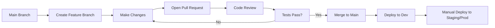
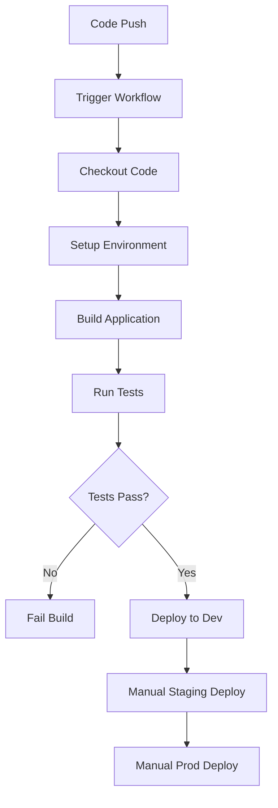
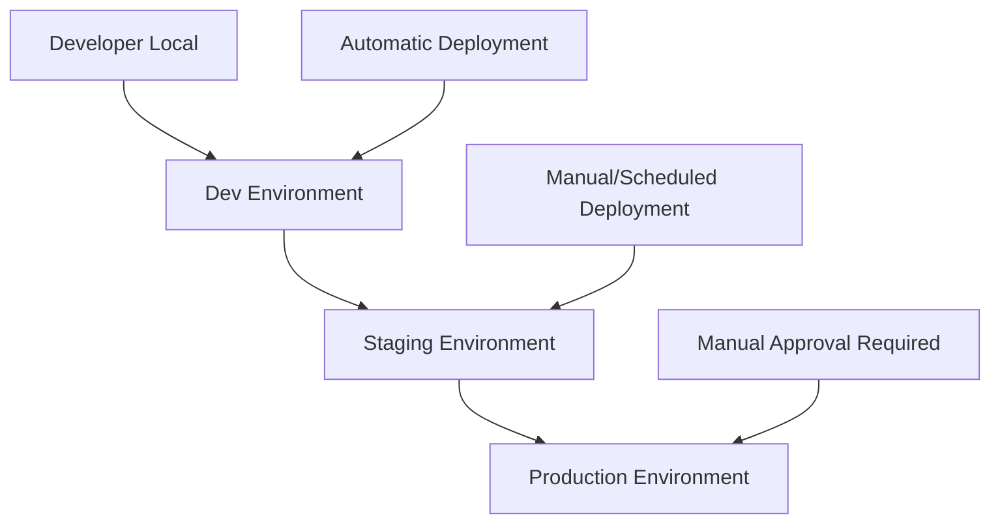

# GitHub CI/CD for .NET Developers
## Course Syllabus - Foundation Level

### Course Overview
This course provides .NET/C# developers with foundational knowledge of GitHub CI/CD workflows, actions, and best practices for small development teams within large organizations. Students will progress from basic team collaboration concepts to implementing automated CI/CD pipelines.

### Prerequisites
- Basic understanding of GitHub repositories (commit, push, branch creation)
- Familiarity with Git commands (pull, merge, fetch, commit)
- Knowledge of .NET CLI commands (dotnet build, dotnet test, dotnet run)
- Basic YAML syntax understanding
- C# programming fundamentals

### Course Structure
5 modules, each designed to complete in 60 minutes or less. Each module includes concept learning, hands-on practice, and team scenario discussions.

---

## Module 1: Team Workflows & GitHub Flow (60 minutes)

### Learning Objectives
- Understand GitHub Flow branching strategy
- Implement proper branch naming conventions
- Create and manage Pull Requests (PRs) effectively
- Apply code review best practices for small teams

### Concepts (20 minutes)
- **GitHub Flow vs. Other Strategies**: Why GitHub Flow works for small teams
- **Branch Naming Conventions**: feature/task-description, bugfix/issue-number
- **Pull Request Workflow**: Draft → Ready for Review → Approved → Merged
- **Code Review Guidelines**: What to look for, how to provide constructive feedback

### Practice Lab (25 minutes)
**Hands-on: Create Your First Team Workflow**
1. Create a new repository with a basic .NET Web API
2. Set up branch protection rules on main branch
3. Create a feature branch following naming conventions
4. Make changes to the API (add a new controller/endpoint)
5. Open a Pull Request with proper description
6. Simulate code review process (self-review)

### Team Scenario (10 minutes)
**Scenario**: Two developers are working on the same repository. Developer A creates `feature/add-user-api` and Developer B creates `feature/add-user-validation`. Both need to modify the same User model. Discuss:
- How to coordinate changes
- When to communicate about overlapping work
- Basic merge conflict resolution approach

### Validation Questions (5 minutes)
1. What makes a good Pull Request description?
2. When should you create a draft PR vs. a ready-for-review PR?
3. What's the difference between merge, squash and merge, and rebase and merge?

---

## Module 2: GitHub Actions Fundamentals (60 minutes)

### Learning Objectives
- Understand GitHub Actions terminology (workflows, jobs, steps, actions)
- Create basic workflow files using YAML
- Configure workflow triggers and runners
- Debug workflow failures

### Concepts (20 minutes)
- **Core Terminology**: 
  - Workflow: Automated process defined by YAML file
  - Job: Set of steps that execute on the same runner
  - Step: Individual task within a job
  - Action: Reusable unit of code
  - Runner: Server that executes workflows
- **Workflow Triggers**: push, pull_request, schedule, manual dispatch
- **Runner Types**: GitHub-hosted vs. self-hosted
- **Workflow File Structure**: Location (.github/workflows/) and naming

### Practice Lab (30 minutes)
**Hands-on: Your First GitHub Action**
1. Create `.github/workflows/basic-ci.yml` in your repository
2. Configure workflow to trigger on push to main and PR creation
3. Set up job to run on ubuntu-latest
4. Add steps to:
   - Checkout code
   - Setup .NET
   - Restore dependencies
   - Build application
5. Test the workflow by pushing changes
6. Review workflow run results and logs

### Team Scenario (5 minutes)
**Scenario**: A developer pushes code that breaks the build. The GitHub Action fails. Discuss:
- How to interpret workflow failure logs
- Steps to fix and re-run the workflow
- Communication protocols when builds fail

### Validation Questions (5 minutes)
1. What's the difference between a workflow and a job?
2. Where do GitHub Action workflow files need to be stored?
3. What happens when a workflow fails on a Pull Request?

---

## Module 3: CI Pipeline with Testing (60 minutes)

### Learning Objectives
- Integrate unit testing into CI pipelines
- Understand code coverage concepts and enforcement
- Configure test result reporting
- Handle test failures in automated workflows

### Concepts (15 minutes)
- **Continuous Integration (CI)**: Automated building and testing of code changes
- **Unit Testing in CI**: Running xUnit tests automatically
- **Code Coverage**: Measurement of how much code is tested
- **Code Coverage Enforcement**: Setting minimum thresholds to maintain quality
- **Test Result Reporting**: Making test outcomes visible in PRs

### Practice Lab (35 minutes)
**Hands-on: Add Testing to Your Pipeline**
1. Add xUnit test project to your Web API solution
2. Write basic unit tests for your API controllers
3. Update GitHub Action workflow to:
   - Run `dotnet test` command
   - Generate code coverage reports
   - Publish test results
4. Configure the workflow to fail if tests fail
5. Test the pipeline by intentionally breaking a test
6. Fix the test and verify green pipeline

### Team Scenario (5 minutes)
**Scenario**: Two developers submit PRs simultaneously. Developer A's tests pass, but Developer B's tests fail due to a dependency on Developer A's changes. Discuss:
- How CI prevents bad code from reaching main
- Coordination strategies for dependent features
- When to merge vs. wait for fixes

### Validation Questions (5 minutes)
1. What is code coverage and why is it important?
2. What should happen when tests fail in a CI pipeline?
3. How does automated testing support the code review process?

---

## Module 4: Multi-Environment CD Pipelines (60 minutes)

### Learning Objectives
- Understand Continuous Deployment (CD) concepts
- Design deployment workflows for dev, staging, and production environments
- Implement environment-specific configurations
- Configure deployment approvals and gates

### Concepts (20 minutes)
- **Continuous Deployment vs. Continuous Delivery**: Automated vs. Manual release triggers
- **Environment Promotion**: Dev → Staging → Production pipeline
- **Environment-Specific Configuration**: Connection strings, feature flags, etc.
- **Deployment Gates**: Manual approvals, health checks, rollback procedures
- **Deployment Strategies**: Blue-green, rolling updates (overview only)

### Practice Lab (30 minutes)
**Hands-on: Multi-Environment Pipeline**
1. Create separate workflow files for different environments
2. Configure deployment triggers:
   - Dev: Automatic on main branch push
   - Staging: Manual trigger or tag-based
   - Production: Manual approval required
3. Add environment-specific steps (placeholder deployment commands)
4. Set up GitHub Environments with protection rules
5. Test the dev deployment workflow
6. Simulate staging and production approval process

### Team Scenario (5 minutes)
**Scenario**: The team lead needs to approve a production deployment, but they're unavailable. A critical bug fix needs to go live. Discuss:
- Emergency deployment procedures
- Backup approval processes
- Documentation requirements for production changes

### Validation Questions (5 minutes)
1. What's the difference between continuous deployment and continuous delivery?
2. Why do we use different triggers for different environments?
3. What are deployment gates and when should you use them?

---

## Module 5: Team Collaboration Scenarios (60 minutes)

### Learning Objectives
- Apply learned concepts to realistic team scenarios
- Troubleshoot common workflow issues
- Implement team communication protocols
- Handle concurrent development challenges

### Concepts (15 minutes)
- **Workflow Orchestration**: Coordinating multiple developers and features
- **Branch Protection Strategies**: Required reviews, status checks
- **Communication Protocols**: When to notify team about build failures, deployments
- **Monitoring and Alerting**: Basic concepts for tracking pipeline health

### Practice Lab (30 minutes)
**Hands-on: Complete Team Workflow**
1. Set up comprehensive branch protection rules
2. Create a workflow that combines all previous modules:
   - CI on all PRs (build + test + coverage)
   - CD to dev on main branch merge
   - Manual staging and production deployments
3. Test the complete workflow with multiple feature branches
4. Simulate a scenario where tests pass locally but fail in CI
5. Practice the complete development cycle: feature → PR → review → merge → deploy

### Team Scenarios (10 minutes)
**Scenario A**: Multiple developers are working on features that will be released together. How do you coordinate integration testing?

**Scenario B**: A deployment to production fails halfway through. How do you handle rollback and communication?

**Scenario C**: The CI pipeline is taking too long, blocking other developers. What are your options?

### Validation Questions (5 minutes)
1. How do branch protection rules support team collaboration?
2. What should you do when a CI pipeline is consistently slow?
3. How do you balance automation with human oversight in deployments?

---

## Glossary & Reference

### Core Terms
- **Workflow**: A configurable automated process made up of one or more jobs, defined in a YAML file
- **Job**: A set of steps that execute on the same runner, jobs run in parallel by default
- **Step**: An individual task within a job, can run commands or actions
- **Action**: A custom application that performs a frequently repeated task
- **Runner**: A server that runs your workflows (GitHub-hosted or self-hosted)
- **Trigger**: An event that causes a workflow to run (push, pull_request, schedule, etc.)

### GitHub Flow Process

### CI/CD Pipeline Flow

### Common Workflow Triggers
- `push`: Triggers when commits are pushed to specified branches
- `pull_request`: Triggers when PRs are opened, synchronized, or reopened
- `workflow_dispatch`: Allows manual triggering from GitHub UI
- `schedule`: Triggers on a schedule using cron syntax

### Environment Hierarchy

---

## Items Planned for Future Versions
- **Advanced Topics**: Hotfix orchestration workflows, advanced merge conflict resolution
- **Azure-Specific**: Azure DevOps integration, ARM templates, Azure Container Registry
- **Code Quality**: Linting, style enforcement, static code analysis
- **Security**: GitHub Secrets management, dependency scanning, security alerts
- **Advanced Testing**: Integration tests, performance tests, test environments
- **Monitoring**: Application insights, deployment monitoring, rollback strategies
- **Alternative Strategies**: GitFlow, trunk-based development comparisons

---

## Course Completion Criteria
Students successfully complete this course when they can:
1. Explain GitHub Flow and its benefits for small teams
2. Create and configure basic GitHub Actions workflows
3. Integrate automated testing into CI pipelines
4. Design multi-environment deployment strategies
5. Troubleshoot common workflow failures
6. Apply proper terminology when discussing CI/CD concepts

## Next Steps
Upon completion, students will be prepared for:
- Advanced GitHub Actions features (matrix builds, caching, artifacts)
- Environment-specific deployment courses (Azure, AWS, etc.)
- Advanced testing strategies and quality gates
- Security and compliance in CI/CD pipelines